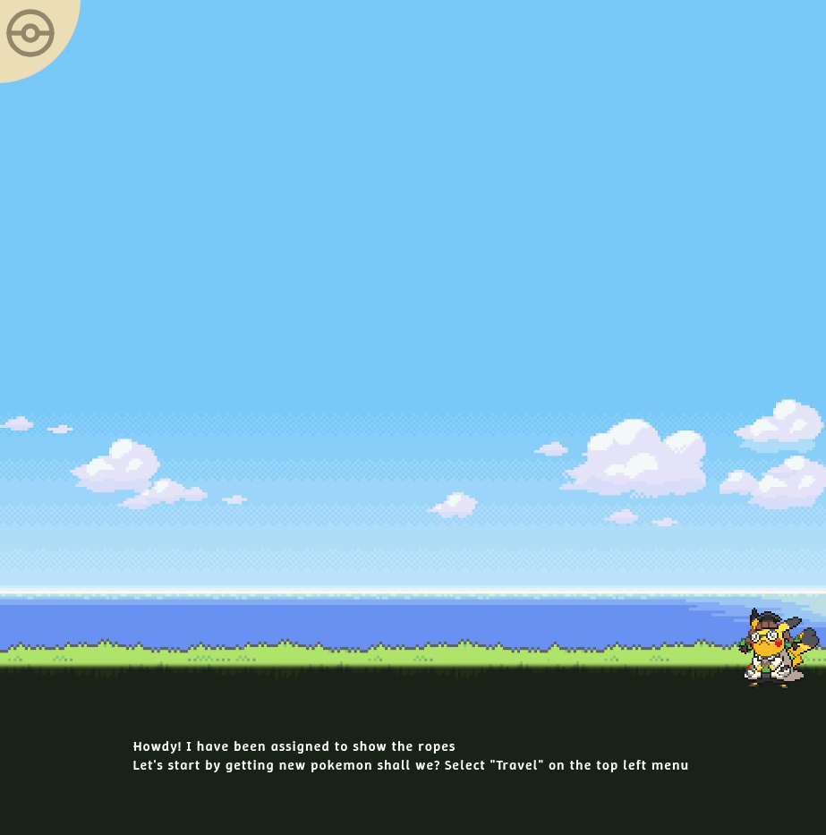
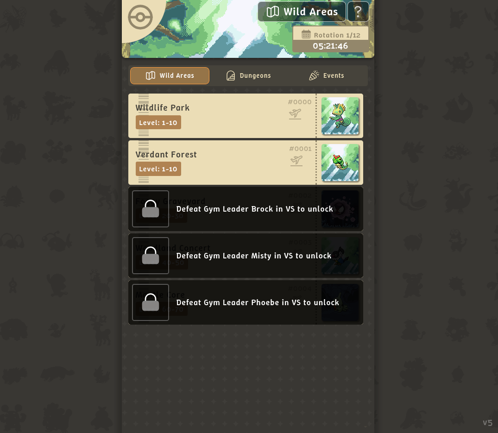
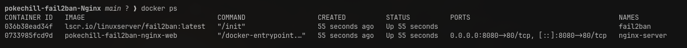

# Pokechill-Fail2ban-Nginx


<figcaption>Image du jeu en cours de fonctionnement sur l'accueil</figcaption>

---

## Table des matières

- [Contexte](#contexte)
  - [Fail2Ban](#fail2ban)
  - [Nginx Rate Limiting](#nginx-rate-limiting)
  - [Différence entre les deux](#différence-entre-les-deux)
- [Architecture du projet](#architecture-du-projet)
- [Mise en place](#mise-en-place)
  - [Prérequis](#prérequis)
  - [1. Espace de travail](#1-espace-de-travail)
  - [2. Configuration de Nginx](#2-configuration-de-nginx)
  - [3. Création du docker-compose.yml](#3-création-du-docker-composeyml)
  - [4. Lancement du projet](#4-lancement-du-projet)
  - [5. Configuration de Fail2Ban](#5-configuration-de-fail2ban)
- [Tester le projet](#tester-le-projet)
  - [Tester le Rate Limiting Nginx](#tester-le-rate-limiting-nginx)
  - [Tester Fail2Ban](#tester-fail2ban)
  - [Commandes utiles Fail2Ban](#commandes-utiles-fail2ban)
- [Résultat Final](#résultat-final)

---

## Contexte

Ce projet n'a pas pour but de présenter PokeChill — c'est simplement un repository open source que nous avons utilisé comme support. L'objectif est d'apprendre à mettre en place deux mécanismes de sécurité réseau : le **rate limiting Nginx** et **Fail2Ban**, en les intégrant dans un environnement Dockerisé.

### Fail2Ban

Fail2Ban est un outil de sécurité qui tourne en arrière-plan et **analyse les logs** de vos services. Quand il détecte un comportement suspect (par exemple : trop de requêtes en peu de temps), il **bannit l'adresse IP** fautive via le firewall du système pour une durée déterminée (dans notre cas, 1 heure).

Concrètement, Fail2Ban lit les logs Nginx, repère les lignes d'erreur `limiting requests`, et bloque l'IP via `iptables`.

### Nginx Rate Limiting

Le rate limiting de Nginx est une fonctionnalité native qui **limite le nombre de requêtes** par IP sur une période donnée. Si une IP dépasse le quota, Nginx répond directement avec une erreur `503` — sans même transmettre la requête à l'application.

C'est un blocage immédiat mais **très court** (moins d'une seconde), contrairement au ban Fail2Ban qui dure 1 heure.

### Différence entre les deux

| | Nginx Rate Limiting | Fail2Ban |
|---|---|---|
| **Où ça agit** | Au niveau de Nginx | Au niveau du firewall (iptables) |
| **Durée du blocage** | Moins d'une seconde | 1 heure (configurable) |
| **Déclenchement** | Quota de requêtes dépassé | Trop d'erreurs dans les logs |
| **Réponse côté client** | Erreur 503 | Connexion refusée / timeout |

Les deux se **complètent** : Nginx coupe le trafic immédiatement, et Fail2Ban prend le relais pour bannir durablement les IPs qui persistent.

---

## Architecture du projet

```text
📁 pokechill-fail2ban-Nginx
├── 📁 app                        ← Le projet PokeChill (cloné depuis GitHub)
│   ├── 📁 font
│   ├── 📁 img
│   ├── 🌐 index.html
│   ├── 📁 scripts
│   └── 🎨 styles.css
├── 📁 docs                       ← Documentation et captures d'écran
│   ├── 📁 img
│   ├── 📝 setup_fail2ban.md
│   └── 📝 setup_nginx_rateLimiting.md
├── 📁 fail2ban
│   ├── ⚙️ config                 ← Généré au premier lancement de Docker
│   └── 📂 log                    ← Logs Fail2Ban
├── 📁 nginx
│   ├── 🐳 Dockerfile
│   ├── 📂 logs                   ← Logs Nginx (lus par Fail2Ban)
│   └── ⚙️ nginx.conf
├── 🐳 docker-compose.yml
└── 📖 README.md
```

---

## Mise en place

### Prérequis

- [Docker](https://docs.docker.com/get-docker/) (avec `docker compose`)
- [Git](https://git-scm.com/)

> **Note :** Toutes les commandes ci-dessous supposent que vous êtes sur **Linux** ou **macOS**. Sur Windows, utilisez WSL2.

---

### 1. Espace de travail

Créer le répertoire principal et entrer dedans :

```bash
mkdir pokechill-fail2ban-Nginx && cd pokechill-fail2ban-Nginx
```

Cloner le projet PokeChill dans un dossier `app` :

```bash
git clone https://github.com/play-pokechill/play-pokechill.github.io.git app
```

Créer les dossiers nécessaires pour Nginx et Fail2Ban :

```bash
mkdir -p nginx/logs fail2ban/config fail2ban/log
```

À ce stade, votre arborescence devrait ressembler à ceci :

```text
pokechill-fail2ban-Nginx/
├── app/
├── fail2ban/
│   ├── config/
│   └── log/
└── nginx/
    └── logs/
```

---

### 2. Configuration de Nginx

Créer les fichiers de configuration :

```bash
touch nginx/nginx.conf nginx/Dockerfile
```

#### `nginx/Dockerfile`

Ce Dockerfile part de l'image officielle `nginx:alpine` et ajoute simplement les fuseaux horaires, ce qui est crucial pour que les timestamps des logs correspondent à l'heure du serveur hôte (Fail2Ban en a besoin pour analyser correctement les logs).

```dockerfile
FROM nginx:alpine

# Synchronisation des fuseaux horaires pour que les logs correspondent
# à l'heure du serveur hôte — crucial pour Fail2Ban
RUN apk add --no-cache tzdata

EXPOSE 80
```

#### `nginx/nginx.conf`

C'est ici que se configure le rate limiting. Copiez ce contenu dans votre `nginx.conf` :

```nginx
user nginx;
worker_processes auto;
pid /var/run/nginx.pid;

events {
    worker_connections 1024;
}

http {
    include       /etc/nginx/mime.types;
    default_type  application/octet-stream;

    # Les logs sont montés en volume pour que Fail2Ban puisse les lire
    access_log /var/log/nginx/access.log;
    error_log  /var/log/nginx/error.log warn;
    # ↑ Le niveau "warn" est important : c'est dans ce fichier que Nginx écrit
    #   les lignes "limiting requests" que Fail2Ban va surveiller

    # ── Définition des zones de rate limiting ──────────────────────────────
    # On crée une zone mémoire partagée qui associe chaque IP à son compteur
    # de requêtes. "10m" = 10 Mo de mémoire partagée (suffit pour ~160 000 IPs)

    limit_req_zone $binary_remote_addr zone=zone_main:10m rate=5r/s;
    # ↑ Zone pour les pages HTML : max 5 requêtes/seconde par IP

    limit_req_zone $binary_remote_addr zone=zone_assets:10m rate=30r/s;
    # ↑ Zone pour les assets statiques (images, scripts, fonts) :
    #   max 30 requêtes/seconde par IP (plus permissif car une page
    #   charge de nombreux assets en parallèle)

    server {
        listen 80;
        server_name _;
        root /usr/share/nginx/html;

        location / {
            limit_req zone=zone_main burst=10 nodelay;
            # ↑ burst=10  : tolère jusqu'à 10 requêtes supplémentaires en rafale
            # ↑ nodelay   : traite la rafale immédiatement (sans mise en file d'attente)
            #   Au-delà du burst, Nginx répond 503

            index index.html;
        }

        location ~* ^/(img|scripts|font)/ {
            limit_req zone=zone_assets burst=200 nodelay;
            # ↑ burst=200 car une page peut charger beaucoup d'assets simultanément

            expires 30d;
            add_header Cache-Control "public, no-transform";
        }
    }
}
```

---

### 3. Création du docker-compose.yml

Créer le fichier à la racine du projet :

```bash
touch docker-compose.yml
```

```yaml
services:
  web:
    build: ./nginx                         # Utilise notre Dockerfile custom
    container_name: nginx-server
    volumes:
      - ./nginx/logs:/var/log/nginx        # Les logs Nginx sont accessibles depuis l'hôte
      - ./nginx/nginx.conf:/etc/nginx/nginx.conf:ro
      - ./app:/usr/share/nginx/html        # Le site est servi depuis le dossier app/
    ports:
      - 8080:80                            # Accessible sur http://localhost:8080
    environment:
      - NGINX_PORT=80

  fail2ban:
    image: lscr.io/linuxserver/fail2ban:latest
    container_name: fail2ban
    cap_add:
      - NET_ADMIN                          # Nécessaire pour modifier les règles iptables
      - NET_RAW
    network_mode: host                     # Accès direct au réseau de l'hôte pour pouvoir bannir des IPs
    environment:
      - PUID=1000
      - PGID=1000
      - TZ=Europe/Paris                    # ← À adapter à votre fuseau horaire
    volumes:
      - ./fail2ban/config:/config/fail2ban # Toute la config (jails, filtres) est persistée ici
      - ./fail2ban/log:/config/log/fail2ban
      - ./nginx/logs:/remotelogs/nginx:ro  # Fail2Ban lit les logs Nginx en lecture seule
    restart: unless-stopped
```

> **Pourquoi `network_mode: host` ?** Fail2Ban doit pouvoir agir sur le firewall de la machine hôte pour bannir des IPs. Sans cet accès réseau direct, il ne peut pas modifier les règles `iptables`.

---

### 4. Lancement du projet

Depuis la racine du projet (`pokechill-fail2ban-Nginx`) :

```bash
docker compose up
```

Vérifiez que les deux conteneurs sont bien lancés :

```bash
docker ps
```

Vous devriez voir `nginx-server` et `fail2ban` avec le statut `Up`.

Le site est maintenant accessible sur **http://localhost:8080**.

---

### 5. Configuration de Fail2Ban

Au premier lancement, Docker va peupler le dossier `fail2ban/config/` avec les fichiers de configuration par défaut.

> **⚠️ IMPORTANT :** Ne modifiez jamais les fichiers de configuration par défaut directement. Toute modification sera **écrasée au redémarrage** du conteneur. Utilisez toujours des fichiers `.local` pour surcharger la configuration.

Accédez au dossier des jails :

```bash
cd fail2ban/config/jail.d
```

Créez votre fichier de configuration personnalisé :

```bash
touch nginx-limit-req.local
```

Copiez-y le contenu suivant :

```ini
[nginx-limit-req]
enabled  = true
port     = http,https
filter   = nginx-limit-req
logpath  = /remotelogs/nginx/error.log
# ↑ Fail2Ban va surveiller ce fichier pour détecter les erreurs de rate limiting

maxretry = 10
# ↑ Nombre d'erreurs tolérées avant bannissement

findtime = 60
# ↑ Fenêtre de temps en secondes (10 erreurs en 60 secondes → ban)

bantime  = 3600
# ↑ Durée du ban en secondes (ici 1 heure)
```

**Comment ça fonctionne ensemble ?** Quand une IP dépasse le rate limit Nginx, Nginx écrit une ligne d'erreur dans `error.log`. Fail2Ban surveille ce fichier et, si une IP cumule 10 de ces erreurs en 60 secondes, il la bannit via `iptables` pendant 1 heure.

Une fois le fichier créé, rechargez la configuration Fail2Ban *(le projet doit être lancé)* :

```bash
docker exec -it fail2ban fail2ban-client reload
```

Vérifiez que le jail est bien actif :

```bash
docker exec -it fail2ban fail2ban-client status nginx-limit-req
```

Vous devriez voir quelque chose comme :

```
Status for the jail: nginx-limit-req
|- Filter
|  |- Currently failed: 0
|  |- Total failed:     0
|  `- File list:        /remotelogs/nginx/error.log
`- Actions
   |- Currently banned: 0
   |- Total banned:     0
   `- Banned IP list:
```

---

## Tester le projet

### Tester le Rate Limiting Nginx

C'est le test le plus simple : **rechargez la page plusieurs fois très rapidement** dans votre navigateur (F5 en rafale). Vous obtiendrez un écran **503 Service Unavailable**.

Le blocage est temporaire (moins d'une seconde), la page redevient accessible dès que vous arrêtez de surcharger.


<figcaption>Écran 503 obtenu après dépassement du rate limit Nginx</figcaption>

---

### Tester Fail2Ban

> **⚠️ IMPORTANT :** Fail2Ban ne bannit **pas** `localhost` (`127.0.0.1`). Tester depuis votre propre machine ne déclenchera aucun ban. Il faut tester **depuis une autre machine** (ex: un autre PC sur le même réseau).

#### Étape 1 — Ouvrir le port sur le firewall de la machine hôte

Si `ufw` n'est pas installé :

```bash
sudo apt install ufw
```

Autoriser les connexions entrantes sur le port 8080 :

```bash
sudo ufw allow 8080/tcp
```

Vérifier que la règle est bien active :

```bash
sudo ufw status
```

#### Étape 2 — Déclencher le ban depuis la machine externe

Depuis **une autre machine**, remplacez `<IP_DU_SERVEUR>` par l'IP de votre machine hôte et lancez la boucle suivante :

```bash
for i in $(seq 1 100); do curl -s -o /dev/null -w "%{http_code}\n" http://<IP_DU_SERVEUR>:8080; done
```

Vous verrez les codes HTTP défiler (`200`, puis `503`). Quand Fail2Ban déclenche le ban, les requêtes n'obtiennent plus aucune réponse (timeout).

#### Étape 3 — Refermer le port une fois les tests terminés

```bash
sudo ufw delete allow 8080/tcp
```


<figcaption>Connexion refusée après bannissement par Fail2Ban</figcaption>

---

### Commandes utiles Fail2Ban

| Commande | Description |
|---|---|
| `docker exec -it fail2ban fail2ban-client reload` | Recharge la configuration sans redémarrer |
| `docker exec -it fail2ban fail2ban-client status nginx-limit-req` | Affiche le statut du jail (IPs bannies, compteurs) |
| `docker exec -it fail2ban fail2ban-client set nginx-limit-req unbanip <IP>` | Débannit une adresse IP spécifique |
| `docker exec -it fail2ban fail2ban-client unban --all` | Débannit toutes les adresses IP |

---

## Résultat Final


<figcaption>Image du jeu en cours de fonctionnement sur la page Travel</figcaption>

### Containers


<figcaption>Les deux conteneurs en cours d'exécution</figcaption>