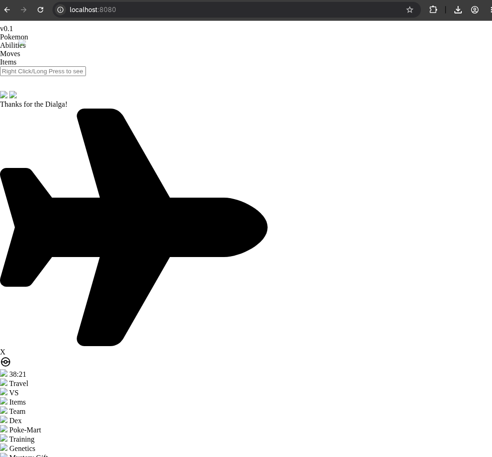
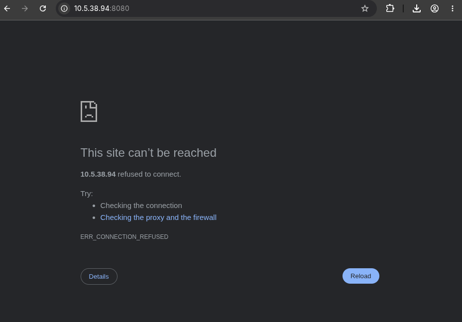

# Guide de mise en place

Ce guide explique comment créer le projet de zéro et le lancer. Pour comprendre ce que font Nginx Rate Limiting et Fail2Ban avant de commencer, consultez [concepts.md](concepts.md).

---

## Table des matières

- [Prérequis](#prérequis)
- [1. Espace de travail](#1-espace-de-travail)
- [2. Configuration de Nginx](#2-configuration-de-nginx)
- [3. docker-compose.yml](#3-docker-composeyml)
- [4. Lancement](#4-lancement)
- [5. Configuration de Fail2Ban](#5-configuration-de-fail2ban)
- [Tester le projet](#tester-le-projet)
    - [Tester le Rate Limiting](#tester-le-rate-limiting)
    - [Tester Fail2Ban](#tester-fail2ban)
    - [Commandes utiles Fail2Ban](#commandes-utiles-fail2ban)

---

## Prérequis

- [Docker](https://docs.docker.com/get-docker/) avec `docker compose` (v2) ou `docker-compose` (v1)
- [Git](https://git-scm.com/)
- Linux ou macOS — sur Windows, utiliser WSL2

> **`docker compose` vs `docker-compose` :** Depuis Docker Desktop 3.6+, la commande intégrée s'écrit `docker compose` (sans tiret). Les versions plus anciennes utilisent `docker-compose` (binaire séparé). Ce guide utilise `docker compose` — si vous avez l'ancienne version, remplacez chaque occurrence.

---

## 1. Espace de travail

Créer le répertoire principal :

```bash
mkdir pokechill-fail2ban-Nginx && cd pokechill-fail2ban-Nginx
```

Cloner PokeChill dans le dossier `app` :

```bash
git clone https://github.com/play-pokechill/play-pokechill.github.io.git app
```

Créer les dossiers nécessaires :

```bash
mkdir -p nginx/logs fail2ban/config fail2ban/log
```

Votre arborescence à ce stade :

```text
pokechill-fail2ban-Nginx/
├── app/
├── fail2ban/
│   ├── config/
│   └── log/
└── nginx/
    └── logs/
```

---

## 2. Configuration de Nginx

```bash
touch nginx/nginx.conf nginx/Dockerfile
```

### `nginx/Dockerfile`

```dockerfile
FROM nginx:alpine

# Synchronisation des fuseaux horaires — crucial pour que les timestamps
# des logs Nginx correspondent à l'heure de l'hôte, que Fail2Ban utilise
# pour calculer les fenêtres de temps (findtime)
RUN apk add --no-cache tzdata

EXPOSE 80
```

### `nginx/nginx.conf`

```nginx
user nginx;
worker_processes auto;
pid /var/run/nginx.pid;

events {
    worker_connections 1024;
}

http {
    include       /etc/nginx/mime.types;
    default_type  application/octet-stream;

    # Les logs sont montés en volume pour que Fail2Ban puisse les lire
    access_log /var/log/nginx/access.log;
    error_log  /var/log/nginx/error.log warn;
    # ↑ Le niveau "warn" est important : c'est ici que Nginx écrit les lignes
    #   "limiting requests" que le filtre nginx-limit-req de Fail2Ban recherche

    # ── Zones de rate limiting ─────────────────────────────────────────────
    limit_req_zone $binary_remote_addr zone=zone_main:10m rate=5r/s;
    # Pages HTML : max 5 requêtes/seconde par IP

    limit_req_zone $binary_remote_addr zone=zone_assets:10m rate=30r/s;
    # Assets statiques : max 30 requêtes/seconde par IP

    server {
        listen 80;
        server_name _;
        root /usr/share/nginx/html;

        location / {
            limit_req zone=zone_main burst=10 nodelay;
            # burst=10 : tolère 10 requêtes supplémentaires en rafale
            # nodelay  : les traite immédiatement sans file d'attente
            # Au-delà → 503 + ligne dans error.log → Fail2Ban peut agir
            index index.html;
        }

        location ~* ^/(img|scripts|font)/ {
            limit_req zone=zone_assets burst=200 nodelay;
            # burst=200 : PokeChill charge beaucoup d'assets simultanément
            expires 30d;
            add_header Cache-Control "public, no-transform";
        }
    }
}
```

---

## 3. docker-compose.yml

```bash
touch docker-compose.yml
```

```yaml
services:
  web:
    build: ./nginx
    container_name: nginx-server
    volumes:
      - ./nginx/logs:/var/log/nginx         # Logs accessibles depuis l'hôte
      - ./nginx/nginx.conf:/etc/nginx/nginx.conf:ro
      - ./app:/usr/share/nginx/html
    ports:
      - 8080:80
    environment:
      - NGINX_PORT=80

  fail2ban:
    image: lscr.io/linuxserver/fail2ban:latest
    container_name: fail2ban
    cap_add:
      - NET_ADMIN                           # Nécessaire pour modifier les règles iptables
      - NET_RAW
    network_mode: host                      # Accès direct au réseau de l'hôte pour bannir des IPs
    environment:
      - PUID=1000
      - PGID=1000
      - TZ=Europe/Paris                     # ← Adapter à votre fuseau horaire
    volumes:
      - ./fail2ban/config:/config/fail2ban  # Config persistée (jails, filtres)
      - ./fail2ban/log:/config/log/fail2ban
      - ./nginx/logs:/remotelogs/nginx:ro   # Fail2Ban lit les logs Nginx en lecture seule
    restart: unless-stopped
```

> **Pourquoi `network_mode: host` ?** Fail2Ban doit modifier les règles `iptables` de la machine hôte pour bannir des IPs. Sans accès direct au réseau hôte, il ne peut pas ajouter ces règles. C'est aussi pour ça que la chaîne `DOCKER-USER` est utilisée dans la configuration du jail — voir [étape 5](#5-configuration-de-fail2ban).

---

## 4. Lancement

```bash
docker compose up -d
```

Vérifiez que les deux conteneurs tournent :

```bash
docker ps
```

Vous devriez voir `nginx-server` et `fail2ban` avec le statut `Up`. Le site est accessible sur **http://localhost:8080**.

---

## 5. Configuration de Fail2Ban

Au premier lancement, Docker peuple automatiquement `fail2ban/config/` avec les fichiers de configuration par défaut (jails, filtres, actions…).

> **⚠️ Ne modifiez jamais les fichiers `.conf` par défaut directement.** Ils sont régénérés à chaque redémarrage du conteneur. Utilisez toujours des fichiers `.local` — ils ont la priorité sur les `.conf` et sont préservés.

Créez votre fichier de jail :

```bash
touch fail2ban/config/jail.d/nginx-limit-req.local
```

Contenu :

```ini
[nginx-limit-req]
enabled  = true
port     = 8080
filter   = nginx-limit-req
logpath  = /remotelogs/nginx/error.log
maxretry = 5
findtime = 600
bantime  = 1h

# Cible la chaîne DOCKER-USER d'iptables — indispensable avec Docker
# La chaîne INPUT par défaut ne filtre pas le trafic routé vers les conteneurs
action = iptables-allports[name=nginx-limit, chain=DOCKER-USER]
```

Rechargez Fail2Ban :

```bash
docker exec -it fail2ban fail2ban-client reload
```

Vérifiez que le jail est actif :

```bash
docker exec -it fail2ban fail2ban-client status nginx-limit-req
```

Résultat attendu :

```
Status for the jail: nginx-limit-req
|- Filter
|  |- Currently failed: 0
|  |- Total failed:     0
|  `- File list:        /remotelogs/nginx/error.log
`- Actions
   |- Currently banned: 0
   |- Total banned:     0
   `- Banned IP list:
```

Si vous voyez ce statut, Fail2Ban surveille activement les logs Nginx.

---

## Tester le projet

### Tester le Rate Limiting

Le test le plus simple : **rechargez la page plusieurs fois très rapidement** dans votre navigateur (F5 en rafale). Vous obtiendrez une page **503 Service Unavailable**.



Le blocage est temporaire — dès que vous arrêtez de surcharger, la page redevient accessible.

Vérifiez que Nginx écrit bien dans les logs pendant le test :

```bash
tail -f nginx/logs/error.log
```

Chaque dépassement génère une ligne contenant `limiting requests` — c'est exactement ce que le filtre Fail2Ban recherche.

---

### Tester Fail2Ban

> **⚠️ Fail2Ban ne bannit pas `127.0.0.1` (localhost).** C'est un comportement intentionnel : bannir sa propre machine serait contre-productif. Il faut tester **depuis une autre machine** sur le même réseau.

#### Étape 1 — Ouvrir le port 8080 sur le firewall de la machine hôte

```bash
sudo apt install ufw          # Si ufw n'est pas installé
sudo ufw allow 8080/tcp
sudo ufw enable               # Si ufw n'est pas encore actif
```

#### Étape 2 — Déclencher le ban depuis la machine externe

Depuis **une autre machine**, remplacez `<IP_DU_SERVEUR>` par l'IP de votre machine hôte :

```bash
for i in $(seq 1 100); do curl -s -o /dev/null -w "%{http_code}\n" http://<IP_DU_SERVEUR>:8080; done
```

Les codes HTTP défilent (`200`, puis `503`). Quand Fail2Ban déclenche le ban, les requêtes n'obtiennent plus aucune réponse — la connexion est refusée au niveau réseau.

Depuis la machine serveur, suivez l'évolution en temps réel :

```bash
docker exec -it fail2ban fail2ban-client status nginx-limit-req
tail -f fail2ban/log/fail2ban.log
```

#### Étape 3 — Refermer le port une fois les tests terminés

```bash
sudo ufw delete allow 8080/tcp
```



---

### Commandes utiles Fail2Ban

| Commande | Description |
|---|---|
| `docker exec -it fail2ban fail2ban-client reload` | Recharge la configuration sans redémarrer le conteneur |
| `docker exec -it fail2ban fail2ban-client status nginx-limit-req` | Statut du jail : IPs bannies, compteurs |
| `docker exec -it fail2ban fail2ban-client set nginx-limit-req unbanip <IP>` | Débannit une IP spécifique |
| `docker exec -it fail2ban fail2ban-client unban --all` | Débannit toutes les IPs |
| `tail -f nginx/logs/error.log` | Surveille les logs Nginx en temps réel |
| `tail -f fail2ban/log/fail2ban.log` | Surveille les actions de Fail2Ban en temps réel |